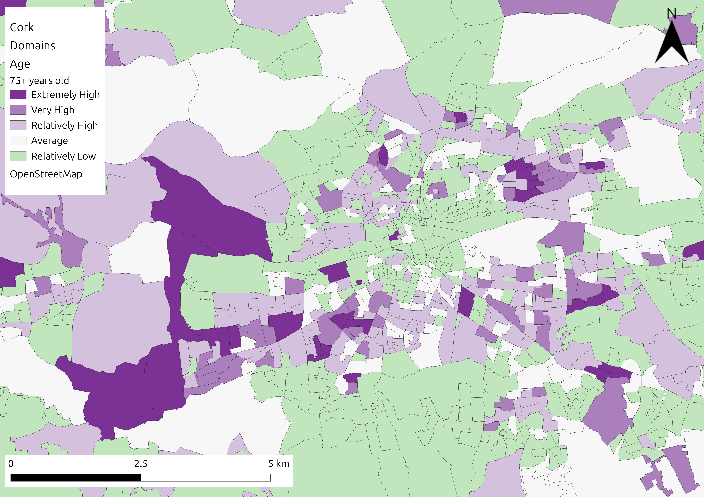
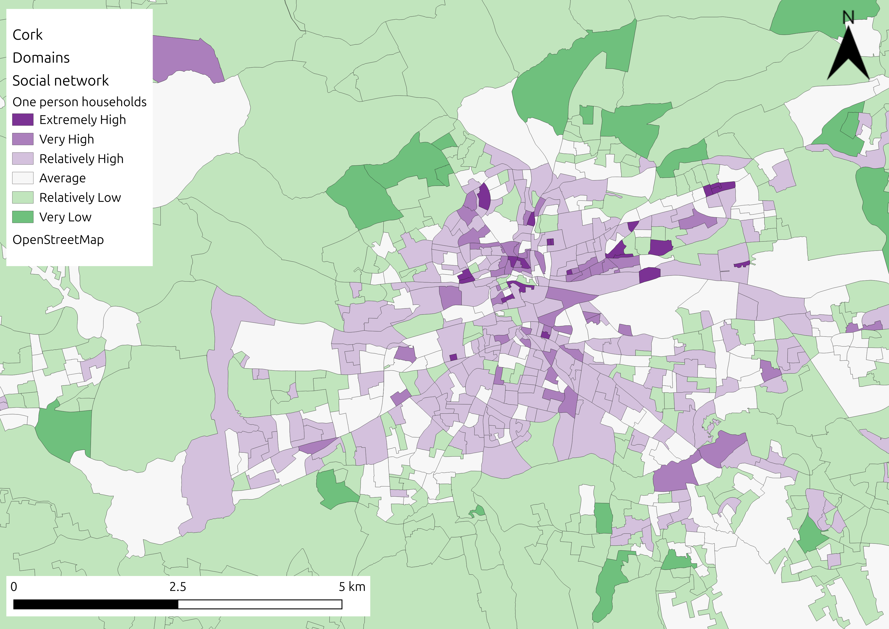
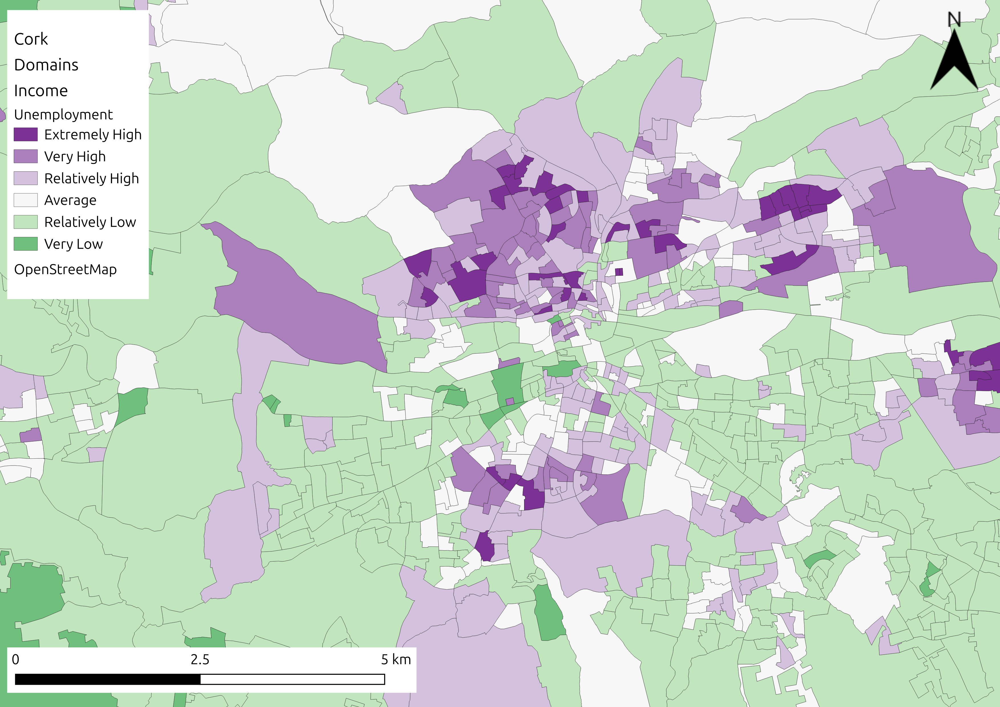
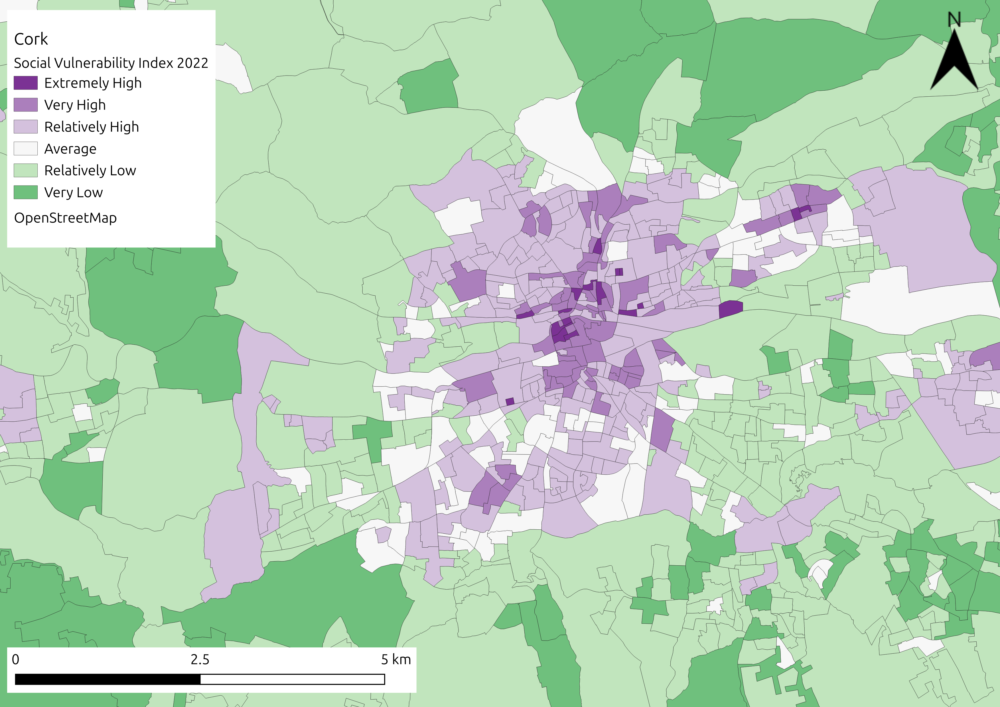

# Methodology
As proposed in the original method indicators are integrated into a hierarchy scheme. Indicators are grouped into domains, with Z-scores for each domain summed with an equal weighting for the spatial area used. The domains are then collated and associated with dimensions of social vulnerability (sensitivity, adaptive capacity and enhanced exposure). Through this research, changes were made to the methodology to ensure it was better tailored to the specific hazards of either flooding or extreme heat, relevant in each area, based on the data available.  New indicators were introduced, such as those for volunteering and unoccupied dwellings, , while indicators in some domains, such as housing characteristics, were found to contribute to additional dimensions.   For example, specific housing characteristic indicators such as households with no central heating and households with private water supplies related better to adaptive capacity in terms of flooding than to enhanced exposure, and where therefore moved to reflect this. 


```{image} VulnScheme.png
:alt: Vulnerability_Scheme
:class: bg-primary mb-1
:width: 500px
:align: center
```

This update to the original methodology, with the inclusion of additional flood specific indicators applied well in Cork City, building a robust SVI score. However, when the authors attempted to apply this same methodology outside of Ireland, in Logroño and Milan, they encountered problems due to the availability of data. Data collection and publication for the national census can differ significantly by country, with different data collection methods, varying time periods for processing, and aggregation of the data at different spatial resolution, dependent upon national resource and General Data Protection Regulation (GDPR) policies. In the case of both Logroño and Milan, some of the domains outlined in Figure 1, did not have available indicator data, with the tables below highlighting the different levels of census data availability in different national contexts and the rationale behind specific indicator selection. Please check the description of the cities in the case studies section to see the tables with the indicators available for each city. 

To account for different data availability and accessibility, the authors adapted the original methodology using the process outlined in the figure below. This was to support the needs of all urban stakeholders and to ensure that the SVI methodology was as robust as possible for cases with differing levels of data availability. This also allows users in areas with lower data availability to easily identify the domains and dimensions where new indicators need to be added through local data collection or acquired in future census campaigns. 
While a variety of potential weighting options (such as z-score, Ranking, Min–max, Distance from the group leader, Division by total, Categorical scale, etc.) can be used, the weighting option chosen for those areas with high levels of data available in all domains (i.e. Cork), was the z-score  with equal weighting method for each domain, whilst for the cases with a lack of data, an easy to follow z-score  with conditional approach based on the relationship between domains and dimensions was proposed. This option was discussed with the city representatives based on their need of interpretability of each domain and indicator as a single stand-alone product and considering the small number of indicators available for domains in some case studies. This methodology was considered by the authors and city representatives to be the least complicated to use and therefore its selection was to ensure ease of use by nontechnical audiences, aligning with the primary goal of the study to ensure the long-term usability of the SVI by local authorities, who may not have a high level of technical expertise. In addition to the cases analysed under this study, the authors proposed an additional weighting methodology for cases where the information available is not representing all the dimensions under the concept of vulnerability. For these cases, the weighting option proposed is the Principal Component Analysis (PCA) applied over the indicators available, ignoring the aggregation of indicators to domains and dimensions. This methodology does not allow the indicators to be viewed as a single stand-alone product but allows the stakeholders to develop a robust index with the information available. This index is not assessing the vulnerability and new indicators are needed to cover the full vulnerability concept, but it could be used as a reference for decision making processes. 

```{image} VulnProcess.png
:alt: Vulnerability_Process
:class: bg-primary mb-1
:width: 500px
:align: center
```

The data collection and pre-processing data is a key part of the process, translating the raw information collected from the data sources into standardized indicators comparable between them. Weighting and aggregation are fundamental steps in constructing composite indices, such as the SVI. Weighting assigns relative importance to each indicator, reflecting its contribution to the overall index. Aggregation combines these weighted indicators into a single composite score, summarising the multidimensional data into a comprehensible measure. 


## Data Collection
1. Begin gathering relevant data from multiple sources, including census data, health records, and environmental datasets, to address various social and economic factors that influence vulnerability, such as income, education, housing quality, and access to healthcare (see supplementary material for potential indicators). Once collected, the data should be cleaned by addressing missing values, removing or correcting outliers, and ensuring consistency. This may involve converting units, standardising variable formats, or geocoding records so that all information aligns with the same geographical units, such as small areas or census tracts.
2. After preprocessing, specific indicators representing different aspects of social vulnerability should be computed; for example, the percentage of the population without higher education or the proportion of one-parent households.
3. In the process of calculating the SVI, z-score normalisation ensures that indicators measured on different scales become comparable. This step adjusts the values so that each indicator has the same magnitude and direction, meaning that higher values consistently reflect higher vulnerability (or vice versa). The z-score technique standardises data based on mean and standard deviation, resulting in a distribution with a mean of 0 and a standard deviation of 1, by applying the equation:
   
$$
Z_score = \frac{x- \mu }{\sigma}
$$

where, x represents the original value, µ is the mean of data and σ is the standard deviation of data. 


## Weighting approaches
Based on the availability of data and indicators for the different case studies and in how these are grouped into several domains, a new set of weighted approaches, are. This allows users to avoid issues where missing data can cause bias in the final vulnerability score. For example, if in the age domain, key information such as the population under <5 is missing, the only indicator left, population >75, would control the domain, unbalancing the domain and potentially the dimension, and creating an overall z-score of vulnerability that will be biased towards a single indicator. 
To avoid bias as much as possible, at least one indicator providing information on the dimensions of sensitivity, adaptive capacity (including ability to prepare, ability to respond, ability to recover) and enhanced exposure, was considered necessary for the creation of an SVI score. Wherever possible, providing a range of indicators for each domain (e.g. >75 years old male and female and <5 years old male and female for the age domain) was considered the best approach, allowing for a more robust overall vulnerability score and subsequent map output. 
To avoid disproportionate weights, a set of tiered rules and methodologies are proposed by the authors. This ensures that all municipal actors and organisations can still avail themselves of the SVI tool, even where there is a lack of available data for all indicators. The rules are based on the different case studies explored in the REACHOUT project and can be used as guidance in deciding appropriate weighting methodologies for other locations. 
Tiered weighting methodologies proposed:
Based on the information available for the cities under analysis and the limitations related to the number of indicators and domains in some areas, we propose a set of tiered methodologies in the calculation of the final vulnerability index. 

### Tier 1 
This case represents the ideal scenario where there are at least two domains per dimension and each domain contains indicators representing the whole population vulnerable to the hazard. For this scenario we propose estimating the weights coefficients based on the number of indicators of each domain. Then for each domain the coefficients are equally distributed between the indicators and the sum of those are equal to 1. 
The whole vulnerability index is then estimated aggregating all the relevant indicators with the weights coefficients estimated through the domains. See equation below.

$$
SVI = \sum_{1}^{n} \sum_{1}^{m} W_{mn} * ind_{m}
$$
$$
W_{mn} = \frac{1}{m}
$$


Where SVI is the vulnerability index, indm  is the mth indicator, m is the total number of indicators for each n domain, and Wmn is the weight of the mth indicator for the nth domain.  

### Tier 2 
This second scenario is recommended for cases where domains have single indicators or where there is a lack of information related to missing indicators. For these domains the weights are halved. See equation below 

$$
SVI = \sum_{1}^{n} \sum_{1}^{m} W_{mn} * ind_{m}
$$
$$
W_{mn}=
\begin{cases}
\frac{1}{2m} \text{ if } m = 1 \text{ or missing key indicators,}\\
\frac{1}{m} \text{ otherwise}
\end{cases}
$$

Where SVI is the vulnerability index, indm is the mth indicator, m is the total number of indicators for each n domain, and Wmn is the weight of the mth indicator for the nth domain.  

### Tier 3 
This third scenario is used in cases where there is only a single domain in any of the three main dimensions. In these cases, the methodology applied to calculating the weighting coefficient is the same as that of the second tier, but the final index is considered less robust and based on a dimension with less information. Some consideration should be taken before making climate decisions based entirely on the social vulnerability index in this scenario. 

### Tier 4
This last option is considering cases where there are dimensions missing. In this case the approach needs to be redefined, and the robustness of the index is highly affected. This approach may be used to estimate vulnerability information related to social and environmental aspects but should not be considered a Social Vulnerability Index. 
We propose a statistical approach based only on the indicators available and not considering the domains. To ensure the most robust output possible, effectively capturing the underlying patterns in the data, we propose using Principal Component Analysis (PCA), which is superior to the equal weighting option in this circumstance. 
When calculating vulnerability indices, multicollinearity among indicators can lead to biased results, as highly correlated features may disproportionately influence the overall index. Principal Component Analysis (PCA) is an effective dimensionality reduction technique that addresses this issue by transforming a set of correlated indicators into a smaller number of uncorrelated principal components (PCs).
The primary purpose of PCA in calculating vulnerability indices is to reduce multicollinearity by transforming correlated indicators into orthogonal components, thereby eliminating redundancy caused by collinearity. Additionally, PCA simplifies the dataset by identifying the minimum number of components that explain the maximum variance, ensuring the focus remains on the most significant features while discarding noise or less-informative indicators. Furthermore, the contribution of each indicator to the principal components can be utilized to derive weight coefficients, ensuring that the importance of correlated features is appropriately distributed.
To derive weight coefficients for calculating vulnerability indices, the process begins by generating a correlation matrix for all indicators to evaluate their relationships and identify potential multicollinearity. This matrix highlights strong positive or negative correlations, which can result in redundancy. The next step involves performing Principal Component Analysis (PCA) using the correlation matrix as input. PCA transforms the original correlated indicators into uncorrelated principal components, addressing the redundancy and collinearity issues.
Once the PCA is performed, the proportion of total variance explained by each principal component is extracted. These variance proportions indicate the relative importance of each component in representing the dataset's information. To ensure components that explain more variances have a greater influence, the values of each principal component are weighted by its corresponding variance proportion. Finally, a weighted mean approach can be used, where the weight coefficients derived from PCA are applied to calculate the final vulnerability score for each area. This approach ensures all indicators contribute appropriately to the index, avoiding disproportionate influence of highly correlated features while retaining the essential variability of the dataset. PCA has gained significant attention in recent years for constructing socioeconomic status indices. By integrating PCA with appropriate weighting and aggregation methods researchers and policymakers can develop more accurate and reliable indices that better inform decision-making processes.


## Aggregation

While <a href="https://www.nature.com/articles/s41598-024-68060-z">Wehbe and Baroud</a> have highlighted limitations to using composite indicators with regard to identifying specific patterns, so that the needs of specific vulnerable groups can be addressed, the research here attempts to counteract this by providing an option for each of the indicators to be viewed as a single stand-alone product, before being combined into dimensions and then finally into a vulnerability index. 

*Visual representation of the SVI for flooding in Cork, alongside indicator specific representations (top left: population aged over 75; bottom left: unemployment; top right: one person households; bottom right: overall vulnerability).*
| ||
|-|-|
| | 


## Accessibility
To ensure widespread accessibility, all material in this research can be reproduced using the open-sourced code and data. The dataset chosen for socio-economic data was the national census which employs open access baseline data that is familiar to users globally and is consistently collected on a ten-year timeframe in almost all countries, providing an excellent repository of information that exists as a global standard.
All code and data from each of the three case studies in the REACHOUT project (Cork, Logroño, Milan) are available to users the case studies section4). As the case studies in Rimini and Northern Ireland (outlined in supplementary material) are further developed, these inputs and outputs will also be included in the open repository. 


