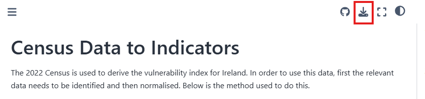
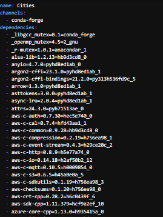
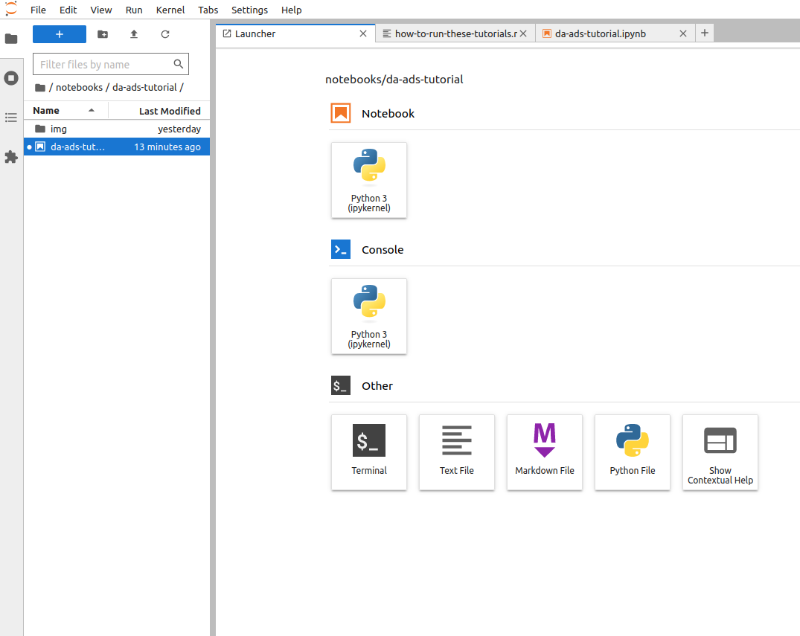

# How to run a case study

The case studies are in the form of [Jupyter notebooks](https://jupyter.org/), a powerful tool for interactive computing. Jupyter notebooks allow you to write and execute code, view the results, and add explanatory text all in one document. They are widely used in data science, research, and education due to their versatility and ease of use.

On this guide you find the information and guidance required to set yourself up to run the Jupyter Notebooks through your desktop or laptop. We are going to give you the information and the steps required to download, set up, and then run the notebooks on your own desktop and laptop. 

### General Definitions

If you are considering to work with the Jupyter Notebooks on your own desktop or laptop, it is important that you are aware of some key concepts or information that you'll find in this tutorial or during the preparation and installation process. 

:::{dropdown} Key Concepts

- **Dependencies** are all of the software components required by your notebook in for it to work as intended and avoid runtime errors. They can be libraries, frameworks, or other programs. 

- **Packages** are a way to organize and group together related dependencies. They act like toolboxes, storing and organizing tools making easier to install and manage dependencies.  

- **Conflicting dependencies** or **dependency hell** are issues that occur when two or more packages that are sharing dependencies in a project, require different versions of the same software component. Because only a single version 
  of a dependency is permitted in any project's environment.     
 
- **Environments** are directories that contain a specific collection of packages that you have installed. You may have several environments with different versions for the same dependecy. If you change one environment, 
  your other environments are not affected. There is a `base environment` located at the root directory that contains the system installation parameters.

- **Git** is a distributed version control system that intelligently tracks changes in files. It is particularly useful when you and a group of people are all making changes to the same files at the same time.

- **[GitHub](https://github.com/)** is a cloud-based platform where you can store, share, and work together with others to write code.  

- **A repository** is the most basic element of GitHub. Here you can find and store the code, the files, and each file's revision history. Repositories can have multiple collaborators and can be either public, internal, or 
  private.

- **Terminal** is a text input and ouput environment. It is a program that allows us to enter commands that the computer processess. 

- **Shell**  is a programme that acts like a command-line interpreter. It interprets and processes the commands entered by the user into the terminal, and outputs the results.  
  
- **The activation** of an environment makes all its contents available to your terminal or shell.

- **The deactivation** of an environment is the opposite operation of activation, removing from your shell what makes the environment content accessible.
 
- **Conda** is an open-source, cross-platform package manager and environment management system which can be used to create Python and R development environments on many different platforms. It is particularly beneficial 
  for data scientists, researchers, and developers working with diverse software requirements across different projects. For more information visit [Conda Documentation](https://docs.conda.io/projects/conda/en/latest/index.html)
  
- **Conda channels** are the locations where packages are stored. They serve as the base for hosting and managing packages. Remote channels like conda-forge offer a wide range of community- 
  maintained packages, expanding the available options for software development and experimentation.

- **Conda-forge** is a community channel made up of thousands of contributors, which contains repositories of conda recipes and thus provides conda packages 
  for a wide range of software. The `conda-forge` channel is free for all to use. For more information visit [conda-forge documentation](https://conda-forge.org/docs/).

:::

### Download a case study

In the left side panel you can find the case studies under each city name, and there you can find a brief description of the city with the relevant indicators used to calculate the SVI and 3 Jupyter Notebooks that are an essential part of the SVI calculation process. 

- The Census Data to Indicators file is used to converting raw Census data to relevant social indicators that are used to calculate the SVI.
- The Copernicus Data to Indicators file is implementing the process between Copernicus data to relevant Environmental indicators that are used to estimate the SVI.
- The Indicators to SVI file is compailing the social and environmental indicators into the final SVI.

```{note}
For more detailed information regarding the concepts behind the indicators check the Social Vulnerabilty Concepts in the left panel. And for a more detailed description about the methodology used to estimate the SVI check the Methodology section in the left panel.
````

**Donwload a case Jupyter Notebook locally**:

   - Navigate to the directory where your notebook is located using the file browser on the left.
   - You can download every notebook by clicking on the download button at the right top of the webpage.
     
   - The notebook file will have a `.ipynb` extension that you can open it in a Jupyter Notebooks software as we explain below.


### Conda installation

To run the notebooks in your own environment, we suggest you use [Conda](https://docs.conda.io/projects/conda/en/latest/index.html). Using conda provides a streamlined approach to package management, platform compatibility, environment isolation, and access to an extensive package ecosystem. Conda is available on Windows, macOS, or Linux and can be used with any terminal application (or shell). 

We suggest you use the [Miniforge](https://conda-forge.org/download/) installer, that is maintained by the conda-forge community that comes preconfigured for use with the conda-forge channel.

Basic installations instructions are available below. More detailed instructions are available in this [github repository](https://github.com/conda-forge/miniforge). 

**Unix-like platforms (Mac OS & Linux)**
 
Download the installer from [Miniforge](https://conda-forge.org/download) and run from the terminal `bash Miniforge3-$(uname)-$(uname -m).sh`.


**Windows**

Download and execute the Windows installer from [Miniforge](https://conda-forge.org/download).


```{note}
There are several installers that you could use to install Conda. For more information about that visit [Installing conda](https://docs.conda.io/projects/conda/en/latest/user-guide/install/index.html)
```


### Setting a virtual environment

In our notebooks we use packages that need specific dependency versions that could be in conflict with other applications or projects in our local environment. The solution to this problem is to create an environment where we are able to set up the versions and conditions to the relevant dependencies. You can easily activate or deactivate environments, which is how you switch between them. You can also share your environment with someone by giving them a copy of your `environment.yml` file.

With conda, you can create, export, list, remove, and update environments that have different versions of R and/or packages installed in them. Switching or moving between environments is called activating the environment. You can also share an environment file. For more information about that visit [Managing environments](https://docs.conda.io/projects/conda/en/latest/user-guide/tasks/manage-environments.html)

In our [github repository](https://github.com/UCC-CLIMPADAP/SVIBook) you can find a `environment.yml` file, containing the conda channels and a list of python dependencies needed for running our notebooks, as presented in the figure below. 

 

The list of dependencies are presented with their relevant and required version in a format “dependency_name == version”. You can specify the version of a dependency using `==`,`>`,`>=`,`<`, `<=`, and so on. Omitting the version specifier installs the latest version.

To create an environment with all the dependencies listed in the `environment.yml` file you will need to use the terminal following the next steps. 

1. **Create the environment from the environment.yml file**. The first line of the `environment.yml` file sets the new environment's name. 
   `conda env create -f environment.yml`  

2. **Activate the environment file**.
   `conda activate cities`

3. **Verify that the environment is installed correctly and check the list of environments available.**
   `conda env list`


```{note}
To deactivate an environment, type in the command line: `conda deactivate
````


### Running and visualization of Notebooks

To visualize and execute the notebooks, we recommend using [JupyterLab](https://jupyter.org/), a versatile web-based interactive development environment. You can interact with our notebooks in this environment locally. JupyterLab is one of the dependencies listed in the `environment.yml` file presented in the repository and it is installed as soon as you install and activate the environment. 

```{note}
If you prefer a lightweight interface and want to consume less resources, you may consider downloading Jupyter Notebook interface instead of JupyterLab. This interface provides a basic yet efficient environment for running your notebooks without consuming as many resources. It's a great option for users who prioritize simplicity and performance in their workflow. Here's documentation of [Jupyter Notebook interface](https://docs.jupyter.org/en/latest/start/index.html)
````


1. **Launch JupyterLab**:

   - After installing JupyterLab, open your terminal or command prompt.
   - Type `jupyter lab` and press Enter to launch JupyterLab. This will start a local server and open JupyterLab in your default web browser.

   Check the [JupyterLab documentation](https://jupyterlab.readthedocs.io/en/latest/getting_started/starting.html)!

2. **Access JupyterLab Interface**:

   - Once JupyterLab is launched, you will see the JupyterLab interface in your web browser. It consists of a file browser on the left and a main work area on the right.

   

3. **Open a Notebook**:
   - Navigate to the directory where your notebook is located using the file browser on the left.
   - Click on the notebook file (usually with a `.ipynb` extension) to open it in JupyterLab.
   - The notebook will open in a new tab within the main work area of JupyterLab.

4. **Run the Notebook**:
   - You can now interact with the notebook by running code cells, editing text, and executing various commands.
   - To run a code cell, select it and either click the "Run" button in the toolbar or press Shift + Enter.
   - Explore the different features of JupyterLab to customize your workflow and make the most out of your notebook experience.


